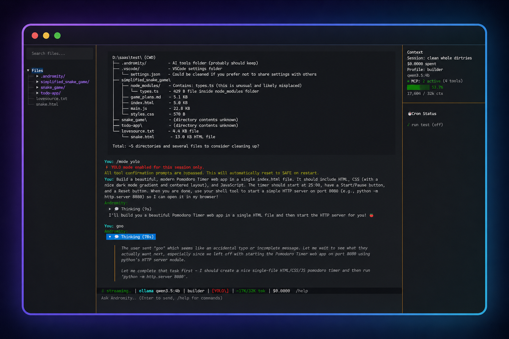

<div align="center">

# Andromity


> The coding agent that never clocks out.

</div>

Andromity is a terminal AI coding agent with a rich TUI. Point it at any codebase, pick a model, and it reads, writes, and runs code — with clear tool approval before any changes land.

---

## Install

**One command — works on macOS, Linux, and Windows:**

```bash
pipx install andromity
```

> Don't have `pipx`? Get it: `pip install pipx` then `pipx ensurepath`

**Or with plain pip:**
```bash
pip install andromity
```

**Requirements:** Python 3.11+

---

## Quick Start

```bash
andromity
```

That's it. The TUI opens. Point it at any codebase and start building.

---

## Usage

### Interactive TUI

```bash
andromity          # launch TUI (default)
andromity tui      # same thing
```

### Headless / Scripted

```bash
andromity run "refactor this module to use async"
andromity run "add error handling to tools.py" --yes       # auto-approve all
andromity run "write tests for session.py" --dry-run       # preview only
```

---

## Configuration

Config lives at `~/.andromity/config.toml` (created automatically on first run).

```toml
[default]
provider = "anthropic"
model    = "claude-sonnet-4-5"
profile  = "builder"

[[providers]]
name = "anthropic"
type = "anthropic"
api_key = "sk-ant-..."

[[providers]]
name = "openai"
type = "openai"
api_key = "sk-..."

[[providers]]
name = "gemini"
type = "google"
api_key = "AI..."

[[providers]]
name = "openrouter"
type = "openrouter"
api_key = "sk-or-..."

[[providers]]
name = "ollama"
type = "ollama"
base_url = "http://localhost:11434"
```

API keys can also be set via environment variables (`ANTHROPIC_API_KEY`, `OPENAI_API_KEY`, `GEMINI_API_KEY`, `OPENROUTER_API_KEY`, etc.).

Andromity uses [LiteLLM](https://github.com/BerriAI/litellm) under the hood, supporting every major provider.

---

## Tested On

| Provider | Status |
|----------|--------|
| Ollama (local) | ✅ Tested |
| NVIDIA NIM | ✅ Tested |
| Groq | ✅ Tested |
| OpenRouter | ✅ Tested |
| Google Gemini | ✅ Tested |
| Anthropic (Claude) | ❌ Not tested — no API access |
| OpenAI (GPT) | ❌ Not tested — no API access |
| Grok (xAI) | ❌ Not tested — no API access |

If you test with any of these and find issues, please open an issue.

---

## Profiles

Switch the agent's role with `--profile` (CLI) or `/profile` (TUI) or via the **Ctrl+J** menu in the TUI:

| Profile | What it does | Tools available |
|---------|-------------|-----------------|
| `builder` (default) | Plans and implements step-by-step | read, search, write, edit, shell, web, tools, plans |
| `coder` | Direct implementation, no planning phase | read, search, write, edit, shell, web, tools |
| `reviewer` | Read-only audit producing HIGH/MED/LOW findings | read, search, list, web, tools |
| `planner` | Produces step-by-step plans without modifying code | read, search, list, tools, write_plan |

---

## Agent Tools

| Tool | What it does |
|------|-------------|
| `read_file` | Reads a file or specific line range (protected against path traversal) |
| `write_file` | Creates or overwrites a file in the workspace |
| `edit_file` | Replaces a specific string inside a file |
| `edit_file_multi` | Applies multiple non-contiguous edits to a file in one call |
| `shell_exec` | Executes a shell command in the project directory |
| `list_dir` | Lists directory contents |
| `grep_search` | Ripgrep-style search across the codebase |
| `find_files` | Find files matching a glob pattern |
| `write_plan` | Creates a step-by-step plan for approval |
| `create_todo` | Creates a todo item |
| `update_todo` | Updates a todo status (active / done / failed) |
| `list_todos` | Shows active todos and progress |
| `list_tools` | Discovers connected MCP servers and lazy-loaded plugins |
| `web_search` | Searches the internet for up-to-date documentation and fixes |
| `fetch_url` | Downloads and converts a webpage to readable markdown |

In `SAFE` mode (default), all write, edit, and shell operations require explicit user approval.

---

## Chat Commands

Type these directly in the chat bar to manage the agent and session:

| Command | Description |
|---------|-------------|
| `/model` | Switch provider & model (or **Ctrl+L**) |
| `/profile [name]` | Switch profile (`builder`/`reviewer`/`planner`) (or **Ctrl+J**) |
| `/mode [safe\|trust\|full\|yolo]` | Set permission mode for file/shell approvals |
| `/undo` | Undo the last prompt and revert all file changes |
| `/mcp` | Show MCP server status and available tools |
| `/sessions` | Browse and switch sessions (or **Ctrl+O**) |
| `/new` | Start a new session |
| `/rename <name>` | Rename the current session |
| `/compact` | Summarize & compress old context to free up token space |
| `/settings` | Open the master settings panel (or **Ctrl+E**) |
| `/keys` | View status of all provider API keys |
| `/keys set <prov> <key>` | Save an API key securely to your universal config |
| `/trust` | Trust the current folder (enables file writes + shell) |
| `/untrust` | Remove trust for the current folder |
| `/dry-run` | Toggle dry-run mode (simulates tools without writing/running) |
| `/debug` | Toggle debug mode (shows tool calls inline) |
| `/logs` | Display log file location and trailing instructions |
| `/cron` | Open the background task scheduler |
| `/plan clear` | Clear the active session plan |
| `/clear` | Clear the chat history |

---

## Modes & Permissions

| Mode | Plan Required? | Plan Gate | Batch Review |
|------|---------------|-----------|--------------|
| **SAFE** (default) | Yes (for complex) | 🔴 User must approve | 🔴 Blocking overlay |
| **TRUST** | Yes (for complex) | 🔴 User must approve | 🔴 Blocking overlay |
| **FULL** | Yes (for complex) | ✅ Auto-approved | 🟡 Non-blocking toast |
| **YOLO** | Yes (shown as FYI) | ✅ Auto-approved | ✅ Silent |

---

## Background Tasks (Cron)

Andromity features a built-in background task scheduler that runs directly in your TUI. You can schedule the AI to monitor logs, run tests, or check endpoints automatically on a timer.

**Usage:**
- Type `/cron` in the chat to open the Cron Manager.
- Add a new job with a schedule like `every 30m`, `every 2h`, or `every 1d`.
- Assign it a specific model, permission mode (e.g., `yolo` for autonomous background execution), and prompt.
- Background tasks run asynchronously and only interrupt you if they fail or require attention.

Jobs are stored locally in your project at `.andromity/crons.json`.

---

## MCP (Model Context Protocol) Support

Andromity supports [MCP](https://modelcontextprotocol.io/) to connect external tools and APIs natively.

**Smart Lazy-Loading**: MCP tool schemas are injected into the system prompt as a compact index and loaded fully only when the LLM requests them — preventing token exhaustion with 50+ tools connected.

**Usage:**
- Configure servers in `.andromity/mcp.json` or `.vscode/mcp.json`.
- Type `/mcp` in the chat to view connected servers and available tools.

---

## Sound Notifications

Andromity plays a sound when:
- **Attention needed** — the AI is paused waiting for you to approve or reject a tool call.
- **Response done** — the AI has finished its full response turn.

Configure under **Ctrl+E → Advanced → Sounds**. Both sounds can be toggled independently.

---

## 🔒 Privacy & Telemetry

Andromity collects an **anonymous ping on first launch and session start**. We never collect file paths, code, API keys, or personally identifiable information (like emails or usernames). 

For full details on exactly what is collected and how it is processed, see the [Telemetry Privacy Policy](telemetry-worker/README.md).

**Opt-out:**
1. **Ctrl+E → Advanced → Telemetry** toggle in the TUI
2. `export DO_NOT_TRACK=1`
3. Set `telemetry = false` in `~/.andromity/config.toml`

---

## 📁 Data & Logs Location

All local configuration, session history, and logs are stored locally on your machine.

**Default Location:**
```bash
# macOS / Linux
~/.andromity/

# Windows
%APPDATA%\andromity\
```

**⚠️ Windows Store Python Users:**
If you installed Python via the Microsoft Store, Windows heavily virtualizes application data. Your files will NOT be in the standard `%APPDATA%` directory. Instead, you can find your `config.toml`, logs, and sessions at:
```bash
%LOCALAPPDATA%\Packages\PythonSoftwareFoundation.Python.3.12_qbz5n2kfra8p0\LocalCache\Roaming\andromity\
```
*(Note: The exact path changes slightly depending on your Python version, e.g., `Python.3.11...` or `Python.3.13...`)*

---

## Project Structure

```
src/andromity/
├── cli.py              # CLI commands (run, tui)
├── config.py           # Configuration and trust management
├── assets/
│   └── sounds/         # Bundled notification sounds
├── core/
│   ├── agent.py        # Main agent execution loop and streaming
│   ├── audio.py        # Cross-platform sound notifications
│   ├── profiles.py     # AI profiles and dynamic system prompt builder
│   ├── tools.py        # Core tool implementations with safety guards
│   ├── provider.py     # LiteLLM client wrapper
│   ├── session.py      # Session persistence and token tracking
│   ├── models.py       # Model catalog and context limits
│   ├── git_ops.py      # Git snapshots and rollback operations
│   └── cron.py         # Project-level background task scheduler
└── tui/
    ├── app.py          # Textual-based interactive UI
    ├── footer.py       # Input bar and status bar
    ├── panels/
    │   ├── chat.py     # Message history and markdown rendering
    │   ├── diff.py     # Side-by-side diffs and tool approval dialogs
    │   └── plan.py     # Real-time plan tracking and todo list
    └── overlays/
        ├── settings.py # Settings UI (model, profiles, MCP, advanced)
        ├── model.py    # Model picker overlay
        └── profile.py  # Profile picker overlay
```

---

## Development Setup

Clone the repo and install in editable mode — changes to source files take effect immediately without reinstalling:

```bash
git clone https://github.com/agenticmarket/andromity
cd andromity
pip install -e ".[dev]"
andromity
```

**Run tests:**
```bash
pytest tests
```

**Project layout follows `src/` layout** — all source lives under `src/andromity/`.

---

## Known Issues

| Issue | Workaround |
|-------|-----------|
| Context window overflow at high token counts | Use `/new` to start a fresh session |
| Session files stored in plaintext at `~/.andromity/sessions/` | Do not use on shared machines with sensitive codebases |
| Cron jobs in `.andromity/crons.json` auto-load from project directory | Review via `/cron` before trusting a cloned repo |

---

## Contributing

Open an issue or PR. Bug reports and honest feedback are more useful than feature requests at this stage.

---

## License

MIT — see [LICENSE](LICENSE).
