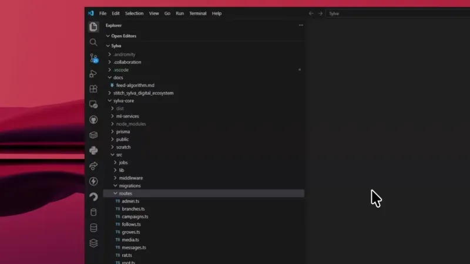
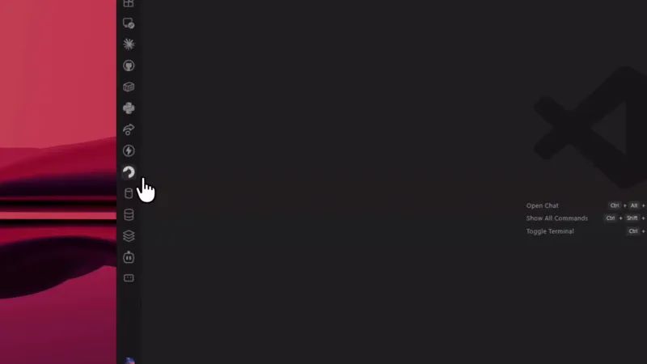
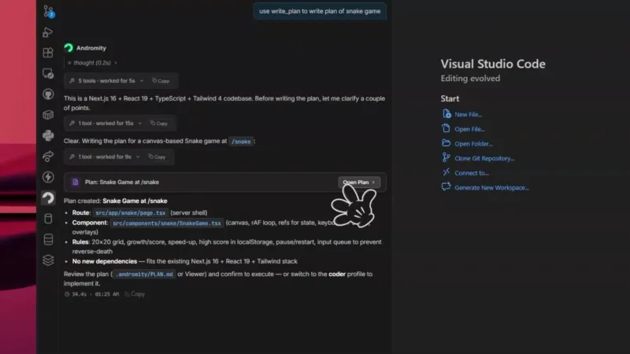
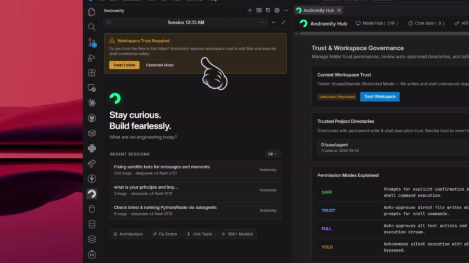

  

  # Andromity – Autonomous AI Coding Agent for VS Code

  **The only AI coding agent with trust governance, subagents, live plans, native diffs & one-click rollback.**

  
  
  
  
  

  [Website](https://andromity.agenticmarket.dev) • [GitHub](https://github.com/agenticmarket/andromity) • [Docs](https://andromity.agenticmarket.dev/docs) • [Report Issue](https://github.com/agenticmarket/andromity/issues)

---

**Andromity** is a private, BYOK (Bring Your Own Key) autonomous AI coding agent for VS Code. Designed as an extensible Copilot and Cursor alternative, it doesn't just autocomplete code — it plans out complex tasks with an interactive task planner, manages parallel subagents, shows you live step-by-step blueprints, lets you review diffs before applying, and gives you instant one-click rollback if you change your mind.

Connect your preferred AI model (**Claude 3.7 Sonnet, GPT-4o, Gemini 2.5 Pro, DeepSeek R1 & V3, Groq, OpenRouter**) or run **100% locally and free with Ollama**.

  

---

## ✨ Interactive Welcome Walkthrough

New to Andromity? VS Code includes a built-in interactive walkthrough to get you oriented in under a minute:
1. Press `Ctrl+Shift+P` (`Cmd+Shift+P` on macOS) to open the Command Palette.
2. Select **`Andromity: Welcome / Getting Started`** (or click the 🚀 rocket icon in the Andromity panel header).
3. Follow the guided walkthrough to tour your AI coding partner, inspect planning blueprints, and adjust workspace governance.

---

## ⚡ Quick Start — Up and Running in Seconds

### 1. Install Extension
Click **Install** on this Marketplace page. That's it!

### 2. Add Your API Key (or Use Local Ollama)
1. Open the **Andromity** tab in your Activity Bar (left sidebar).
2. Click the ⚙️ **Settings** icon in the header.
3. Paste the API key for your favorite provider:
   - **Anthropic** (Claude 3.7 / 3.5 Sonnet)
   - **OpenAI** (GPT-4o, o3-mini)
   - **Google Gemini** (Gemini 2.5 Pro / Flash)
   - **Groq** (Llama 3.3 70B, DeepSeek)
   - **DeepSeek / OpenRouter**
   - **Ollama (Free / Local)**: No API key required! Just have Ollama running locally on your machine.

  

### 3. Start Coding!
Press `Ctrl+Alt+C` (`Cmd+Alt+C` on macOS) or open the sidebar. Ask a question, select a file, or describe a feature you want to build.

---

## 🚀 How to Use Andromity in Your Workflow

### 💬 1. Interactive Sidebar Chat
- Chat directly with the AI about your workspace.
- Reference files with `@` mentions.
- The agent reads files, diagnoses bugs, implements features, and writes tests.

### 📝 2. Live Task Planner & Blueprints
When tackling complex tasks, Andromity creates an interactive implementation plan first.
- Review steps before changes happen.
- Approve, skip, or edit steps individually.
- Watch real-time execution status for each task.

  

### 🔍 3. Side-by-Side Diff Review
Every change proposed by the agent is presented as a native VS Code diff.
- See exact additions and deletions.
- Accept changes file-by-file or accept all at once.

### ⏪ 4. One-Click Rollback (`/undo`)
Made a turn you don't like? Simply trigger **Undo Last Turn** from the header menu or command palette. Andromity rolls back all file changes from that turn instantly without touching your git history.

### 🤖 5. Multi-Agent & Parallel Subagents
Spawn background subagents for research, file scanning, or isolated task implementation while you continue chatting in the main session.

### 🔌 6. Model Context Protocol (MCP) Ready
Connect any MCP server (tools, documentation, database connectors) directly into the agent workflow. Schemas load on demand to minimize token usage.

### 🖱️ 7. Right-Click Context Menu Superpowers
Highlight any snippet in your code editor, right-click, and choose:
- **Ask About Selection** (`Ctrl+Alt+A`): Inquire about logic or behavior.
- **Explain Code** (`Ctrl+Alt+E`): Get a breakdown of what the code does.
- **Fix Diagnostics & Errors**: Auto-resolve type errors, linter warnings, or crashes.
- **Generate Unit Tests** (`Ctrl+Alt+T`): Auto-generate complete test suites for your functions or classes.

### ✍️ 8. AI Git Commit Messages
Click the **Andromity icon** directly in the Source Control panel title bar to generate a clean, descriptive commit message based on your staged changes.

---

## 🔐 Trust Governance (Permission Modes)

You are always in control of what the agent does in your workspace:

| Mode | Plans | File Writes | Terminal Commands |
|------|-------|-------------|-------------------|
| **SAFE** *(default)* | You approve each one | You approve each one | You approve each one |
| **TRUST** | You approve | Direct (No review needed) | Direct (No review needed) |
| **FULL** | Auto-runs with live log | Direct | Direct |
| **YOLO** | Auto-runs silently | Silent | Silent |

  

Switch modes anytime by clicking the permission badge in the top bar or via `Andromity: Switch Permission Mode`.

---

## 🤖 4 Specialized Agent Profiles

Switch profiles depending on what you're working on:

- **🏗️ Builder** *(default)*: Plans out tasks first, then implements them.
- **⚡ Coder**: Fast direct implementation without an upfront planning stage.
- **🧐 Reviewer**: Read-only mode for code audits, security checks, and PR reviews.
- **📐 Planner**: Generates architectural specs and technical plans without modifying code.

---

## ⌨️ Keyboard Shortcuts

| Shortcut | macOS | Action |
|----------|-------|--------|
| `Ctrl+Alt+C` | `Cmd+Alt+C` | Open Andromity Chat |
| `Ctrl+Alt+A` | `Cmd+Alt+A` | Ask About Selected Code |
| `Ctrl+Alt+E` | `Cmd+Alt+E` | Explain Selected Code |
| `Ctrl+Alt+T` | `Cmd+Alt+T` | Generate Unit Tests for Selection |

---

## ⚙️ Extension Settings

Customize Andromity in **Settings** (`Ctrl+,` → search `Andromity`):

- `andromity.defaultProvider`: Default AI provider (`anthropic`, `openai`, `google`, `groq`, `openrouter`, `ollama`, `nvidia`).
- `andromity.defaultModel`: Default model (e.g., `claude-sonnet-4-6`, `gpt-4o`, `gemini-2.5-pro`).
- `andromity.defaultProfile`: Default agent profile (`builder`, `coder`, `reviewer`, `planner`).
- `andromity.permissionMode`: Default trust mode (`safe`, `trust`, `full`, `yolo`).
- `andromity.reasoningEffort`: Thinking level for reasoning models (`off`, `low`, `medium`, `high`).
- `andromity.soundNotifications`: Enable or disable turn completion sound cues.

---

## 🔒 Privacy & Security First

- **Zero Data Collection:** Your code and prompts go strictly between your machine and your chosen AI provider.
- **Local Secret Storage:** API keys are encrypted locally using VS Code's native Secret Storage API.
- **100% Offline Capability:** Use Ollama to keep all code and conversations strictly local on your machine.

---

## 🌐 Links & Community

- 🏠 **Website:** [andromity.agenticmarket.dev](https://andromity.agenticmarket.dev)
- 🐙 **GitHub:** [agenticmarket/andromity](https://github.com/agenticmarket/andromity)
- 💬 **Discussions & Feedback:** [GitHub Discussions](https://github.com/agenticmarket/andromity/discussions)
- 🐛 **Bug Reports & Requests:** [GitHub Issues](https://github.com/agenticmarket/andromity/issues)

---

**Built with ❤️ for developers by [AgenticMarket](https://github.com/agenticmarket)**

[MIT License](https://github.com/agenticmarket/andromity/blob/main/LICENSE)

